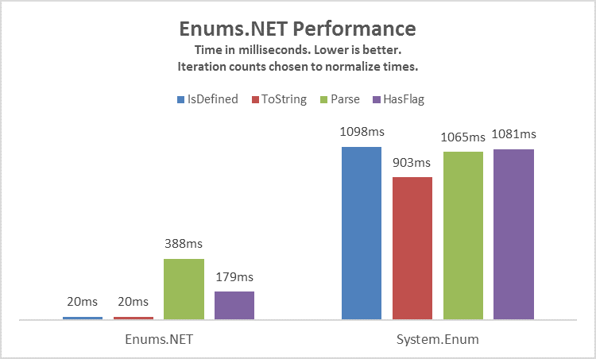

# Enums.NET
Enums.NET is a high-performance type-safe .NET enum utility library which caches enum members' name, value, and attributes and provides many operations as C# extension methods for ease of use. It is available as a [NuGet Package](https://www.nuget.org/packages/Enums.NET/) and is compatible with .NET Framework 2.0+ and .NET Standard 1.0+.

## What's wrong with `System.Enum`
1. Most of its static methods are non-generic which make them a pain to use and cause poor performance.
2. Most of its methods use reflection on each call without any sort of caching causing poor performance.
3. Its support for flag enum operations is extremely limited. The only flag enum method on `System.Enum` is the `HasFlag` method which is very slow, is not type-safe, and is ambiguous as to whether it determines if the value has all or any of the specified flags. It's all by the way.
4. It has no built-in support for retrieval of `Attribute`s applied to enum members which is a common practice for retrieval of the `DescriptionAttribute` or `EnumMemberAttribute`.

Enums.NET solves all of these issues and more.

## Enums.NET Demo

```cs
using System;
using System.Collections.Generic;
using System.Linq;
using EnumsNET;
using NUnit.Framework;
using DescriptionAttribute = System.ComponentModel.DescriptionAttribute;

[TestFixture]
class EnumsNETDemo
{
	// Test enum definitions at the bottom

	[Test]
	public void Enumerate()
	{
		// Retrieves enum members in increasing value order
		foreach (EnumMember<NumericOperator> member in Enums.GetEnumMembers<NumericOperator>())
		{
			NumericOperator value = member.Value;
			string name = member.Name;
			// Do stuff
		}
		Assert.AreEqual(8, Enums.GetEnumMembers<NumericOperator>().Count());
		Assert.AreEqual(6, Enums.GetEnumMembers<NumericOperator>(excludeDuplicates: true).Count());
	}

	[Test]
	public void Validate()
	{
		// Standard Enums, checks is defined
		Assert.IsTrue(NumericOperator.LessThan.IsValid());
		Assert.IsFalse(((NumericOperator)20).IsValid());

		// Flag Enums, checks is valid flag combination or is defined
		Assert.IsTrue((DaysOfWeek.Sunday | DaysOfWeek.Wednesday).IsValid());
		Assert.IsFalse((DaysOfWeek.Sunday | DaysOfWeek.Wednesday | ((DaysOfWeek)(-1))).IsValid());

		// Custom validation through IEnumValidatorAttribute
		Assert.IsTrue(DayType.Weekday.IsValid());
		Assert.IsTrue((DayType.Weekday | DayType.Holiday).IsValid());
		Assert.IsFalse((DayType.Weekday | DayType.Weekend).IsValid());
	}

	[Test]
	public void FlagEnumOperations()
	{
		// CombineFlags ~ bitwise OR
		Assert.AreEqual(DaysOfWeek.Monday | DaysOfWeek.Wednesday, DaysOfWeek.Monday.CombineFlags(DaysOfWeek.Wednesday));
		Assert.AreEqual(DaysOfWeek.Monday | DaysOfWeek.Wednesday | DaysOfWeek.Friday, FlagEnums.CombineFlags(DaysOfWeek.Monday, DaysOfWeek.Wednesday, DaysOfWeek.Friday));

		// HasAnyFlags
		Assert.IsTrue(DaysOfWeek.Monday.HasAnyFlags(DaysOfWeek.Monday | DaysOfWeek.Wednesday));
		Assert.IsFalse((DaysOfWeek.Monday | DaysOfWeek.Wednesday).HasAnyFlags(DaysOfWeek.Friday));

		// HasAllFlags
		Assert.IsTrue((DaysOfWeek.Monday | DaysOfWeek.Wednesday | DaysOfWeek.Friday).HasAllFlags(DaysOfWeek.Monday | DaysOfWeek.Wednesday));
		Assert.IsFalse(DaysOfWeek.Monday.HasAllFlags(DaysOfWeek.Monday | DaysOfWeek.Wednesday));

		// CommonFlags ~ bitwise AND
		Assert.AreEqual(DaysOfWeek.Monday, DaysOfWeek.Monday.CommonFlags(DaysOfWeek.Monday | DaysOfWeek.Wednesday));
		Assert.AreEqual(DaysOfWeek.None, DaysOfWeek.Monday.CommonFlags(DaysOfWeek.Wednesday));

		// RemoveFlags
		Assert.AreEqual(DaysOfWeek.Wednesday, (DaysOfWeek.Monday | DaysOfWeek.Wednesday).RemoveFlags(DaysOfWeek.Monday));
		Assert.AreEqual(DaysOfWeek.None, (DaysOfWeek.Monday | DaysOfWeek.Wednesday).RemoveFlags(DaysOfWeek.Monday | DaysOfWeek.Wednesday));

		// GetFlags, splits out the individual flags in increasing value order
		List<DaysOfWeek> flags = DaysOfWeek.Weekend.GetFlags().ToList();
		Assert.AreEqual(2, flags.Count);
		Assert.AreEqual(DaysOfWeek.Sunday, flags[0]);
		Assert.AreEqual(DaysOfWeek.Saturday, flags[1]);

		// GetAllFlags
		Assert.AreEqual(DaysOfWeek.All, FlagEnums.GetAllFlags<DaysOfWeek>());
	}

	[Test]
	public void Name()
	{
		Assert.AreEqual("Equals", NumericOperator.Equals.GetName());
		Assert.IsNull(((NumericOperator)(-1)).GetName());
	}

	[Test]
	public void Attributes()
	{
		Assert.IsTrue(NumericOperator.GreaterThanOrEquals.GetEnumMember().HasAttribute<PrimaryEnumMemberAttribute>());
		Assert.IsFalse(Enums.GetEnumMember<NumericOperator>("NotLessThan").HasAttribute<PrimaryEnumMemberAttribute>());
		Assert.AreEqual("Is not", NumericOperator.NotEquals.GetEnumMember().GetAttribute<DescriptionAttribute>().Description);
		Assert.IsNull(NumericOperator.LessThan.GetEnumMember().GetAttribute<DescriptionAttribute>());
	}

	[Test]
	public void Parsing()
	{
		Assert.AreEqual(NumericOperator.GreaterThan, Enums.Parse<NumericOperator>("GreaterThan"));
		Assert.AreEqual(NumericOperator.NotEquals, Enums.Parse<NumericOperator>("1"));
		Assert.AreEqual(NumericOperator.Equals, Enums.Parse<NumericOperator>("Is", EnumFormat.Description));

		Assert.AreEqual(DaysOfWeek.Monday | DaysOfWeek.Wednesday, Enums.Parse<DaysOfWeek>("Monday, Wednesday"));
		Assert.AreEqual(DaysOfWeek.Tuesday | DaysOfWeek.Thursday, FlagEnums.ParseFlags<DaysOfWeek>("Tuesday | Thursday", delimiter: "|"));
	}

	[Test]
	public void Description()
	{
		Assert.AreEqual("Is", NumericOperator.Equals.AsString(EnumFormat.Description));
		Assert.IsNull(NumericOperator.LessThan.AsString(EnumFormat.Description));
		// Gets the description if applied, otherwise the name
		Assert.AreEqual("LessThan", NumericOperator.LessThan.AsString(EnumFormat.Description, EnumFormat.Name));
	}

	[Test]
	public void CustomEnumFormat()
	{
		EnumFormat symbolFormat = Enums.RegisterCustomEnumFormat(member => member.GetAttribute<SymbolAttribute>()?.Symbol);
		Assert.AreEqual(">", NumericOperator.GreaterThan.AsString(symbolFormat));
		Assert.AreEqual(NumericOperator.LessThan, Enums.Parse<NumericOperator>("<", symbolFormat));
	}

	enum NumericOperator
	{
		[Description("Is")]
		[Symbol("=")]
		Equals,
		[Description("Is not")]
		[Symbol("!=")]
		NotEquals,
		[Symbol("<")]
		LessThan,
		[PrimaryEnumMember] // Indicates enum member as primary duplicate for extension methods
		[Symbol(">=")]
		GreaterThanOrEquals,
		NotLessThan = GreaterThanOrEquals,
		[Symbol(">")]
		GreaterThan,
		[PrimaryEnumMember]
		[Symbol("<=")]
		LessThanOrEquals,
		NotGreaterThan = LessThanOrEquals
	}

	[Flags]
	enum DaysOfWeek
	{
		None = 0,
		Sunday = 1,
		Monday = 2,
		Tuesday = 4,
		Wednesday = 8,
		Thursday = 16,
		Friday = 32,
		Weekdays = Monday | Tuesday | Wednesday | Thursday | Friday,
		Saturday = 64,
		Weekend = Sunday | Saturday,
		All = Sunday | Monday | Tuesday | Wednesday | Thursday | Friday | Saturday
	}

	[Flags]
	[DayTypeValidator]
	enum DayType
	{
		Weekday = 1,
		Weekend = 2,
		Holiday = 4
	}

	[AttributeUsage(AttributeTargets.Field)]
	class SymbolAttribute : Attribute
	{
		public string Symbol { get; }

		public SymbolAttribute(string symbol)
		{
			Symbol = symbol;
		}
	}

	[AttributeUsage(AttributeTargets.Enum)]
	class DayTypeValidatorAttribute : Attribute, IEnumValidatorAttribute<DayType>
	{
		public bool IsValid(DayType value) => value == DayType.Weekday || value == DayType.Weekend || value == (DayType.Weekday | DayType.Holiday) || value == (DayType.Weekend | DayType.Holiday);
	}
}
```

## Performance Comparison


## How Is It Type-Safe
Currently, there is no direct way to constrain a type or method's generic type parameter to an enum in C#. The C# compiler can understand when this constraint is applied, it just can't currently express it. Utilizing Simon Cropp's Fody, on build a post-processing step is applied to the compiled Enums.NET assembly to add these constraints to the assembly, thus achieving type safety.

## Interface
`EnumsNET.Enums` static class for type-safe standard enum operations, with many exposed as C# extension methods.

`EnumsNET.FlagEnums` static class for type-safe flag enum operations, with many exposed as C# extension methods.

`EnumsNET.Unsafe.UnsafeEnums` static class for standard enum operations without the enum constraint for use in generic programming.

`EnumsNET.Unsafe.UnsafeFlagEnums` static class for flag enum operations without the enum constraint for use in generic programming.

`EnumsNET.NonGeneric.NonGenericEnums` static class for non-generic standard enum operations.

`EnumsNET.NonGeneric.NonGenericFlagEnums` static class for non-generic flag enum operations.

## Credits
Inspired by Jon Skeet's [Unconstrained Melody] (https://github.com/jskeet/unconstrained-melody).

Uses Simon Cropp's [Fody](https://github.com/Fody/Fody) & [Fody.ExtraConstraints](https://github.com/Fody/ExtraConstraints) which is built on Jb Evain's [Mono.Cecil](https://github.com/jbevain/cecil).

Uses modified build scripts and repository structure from James Newton-King's [Json.NET](https://github.com/JamesNK/Newtonsoft.Json).
